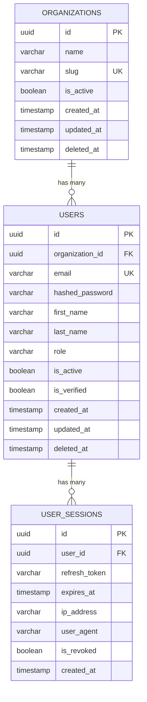

# CRM Enterprise SaaS - Module 1: Auth & Org Management

A multi-tenant, production-grade CRM SaaS application designed to scale with clean architecture principles.

---

## 1. Directory Structure

```
crm-saas/
├── backend/
│   ├── app/
│   │   ├── api/          # Route controller endpoints (v1)
│   │   ├── core/         # Config, security, database session
│   │   ├── models/       # Declarative SQLAlchemy models
│   │   ├── schemas/      # Pydantic v2 schemas
│   │   ├── repositories/ # Abstract CRUD Repository Pattern
│   │   ├── services/     # Core Business logic
│   │   ├── dependencies/ # Auth and tenant dependency injection
│   │   └── tests/        # Pytest integration tests
│   ├── Dockerfile
│   ├── requirements.txt
│   └── main.py
├── frontend/
│   ├── src/
│   │   ├── modules/      # Page components (Auth, Dashboard, Org Profile)
│   │   ├── layouts/      # Base layouts (Auth / App views)
│   │   ├── store/        # Zustand state stores
│   │   ├── services/     # Axios client configuration with JWT rotation
│   │   ├── components/   # Protected routes wrapper
│   │   ├── App.tsx
│   │   ├── main.tsx
│   │   └── index.css
│   ├── Dockerfile
│   ├── tailwind.config.js
│   ├── vite.config.ts
│   └── package.json
├── docker-compose.yml
├── nginx.conf
└── README.md
```

---

## 2. Database Schema (Module 1)

### ER Diagram


### Constraints & Indexes
* **Organizations Table**: Unique index on `slug` for fast tenant routing lookup. Soft deletion column `deleted_at` tracked for records exclusion.
* **Users Table**: Unique index on `email`. Foreign key mapping to `organizations(id)` containing database-level CASCADE delete.
* **Sessions Table**: Index on `refresh_token` and `user_id`. Automatic rotation invalidates existing tokens.

---

## 3. API Examples

### Register Tenant
* **POST** `/api/v1/auth/register`
* **Request Payload**:
```json
{
  "company_name": "Acme Corp",
  "slug": "acme",
  "admin_email": "admin@acme.com",
  "admin_password": "supersecurepassword123",
  "first_name": "John",
  "last_name": "Doe"
}
```
* **Response (200 OK)**:
```json
{
  "user": {
    "id": "e6741b02-53b9-4fca-89a1-43224b89fa7a",
    "organization_id": "48b26c04-f655-46aa-ac9d-bf84f227ee2e",
    "email": "admin@acme.com",
    "first_name": "John",
    "last_name": "Doe",
    "role": "OrgAdmin",
    "is_active": true,
    "is_verified": true,
    "created_at": "2026-06-03T16:32:00Z",
    "updated_at": "2026-06-03T16:32:00Z"
  },
  "organization": {
    "id": "48b26c04-f655-46aa-ac9d-bf84f227ee2e",
    "name": "Acme Corp",
    "slug": "acme",
    "is_active": true,
    "created_at": "2026-06-03T16:32:00Z",
    "updated_at": "2026-06-03T16:32:00Z"
  }
}
```

### Login User
* **POST** `/api/v1/auth/login`
* **Request Payload**:
```json
{
  "email": "admin@acme.com",
  "password": "supersecurepassword123"
}
```
* **Response (200 OK)**:
```json
{
  "access_token": "eyJhbGciOiJIUzI1NiIsInR5cCI6IkpXVCJ9...",
  "refresh_token": "eyJhbGciOiJIUzI1NiIsInR5cCI6IkpXVCJ9...",
  "token_type": "bearer"
}
```

### Update Organization Profile (Admin Only)
* **PUT** `/api/v1/organizations/my`
* **Headers**: `Authorization: Bearer <access_token>`
* **Request Payload**:
```json
{
  "name": "Acme International"
}
```
* **Response (200 OK)**:
```json
{
  "id": "48b26c04-f655-46aa-ac9d-bf84f227ee2e",
  "name": "Acme International",
  "slug": "acme",
  "is_active": true,
  "created_at": "2026-06-03T16:32:00Z",
  "updated_at": "2026-06-03T16:33:00Z"
}
```

---

## 4. Run & Test Instructions

### Running in Docker
To spin up all services including PostgreSQL, Redis, Backend (FastAPI), Frontend (Vite + Tailwind), and Nginx:
```bash
docker compose up --build
```
Once initialized, visit:
* Frontend App: `http://localhost` (Proxied via Nginx)
* API Swagger Docs: `http://localhost/api/v1/openapi.json` or Swagger at `http://localhost/api/v1/docs` (Note: Backend runs on port 8000, mapped internally).

### Running Automated Test Suite
To run pytest inside the backend container or locally:
```bash
docker compose exec backend pytest -v
```
To run tests locally without Docker, install requirements and run:
```bash
cd backend
pip install -r requirements.txt
pytest -v
```
*(Tests utilize a isolated SQLite in-memory database configuration automatically).*
