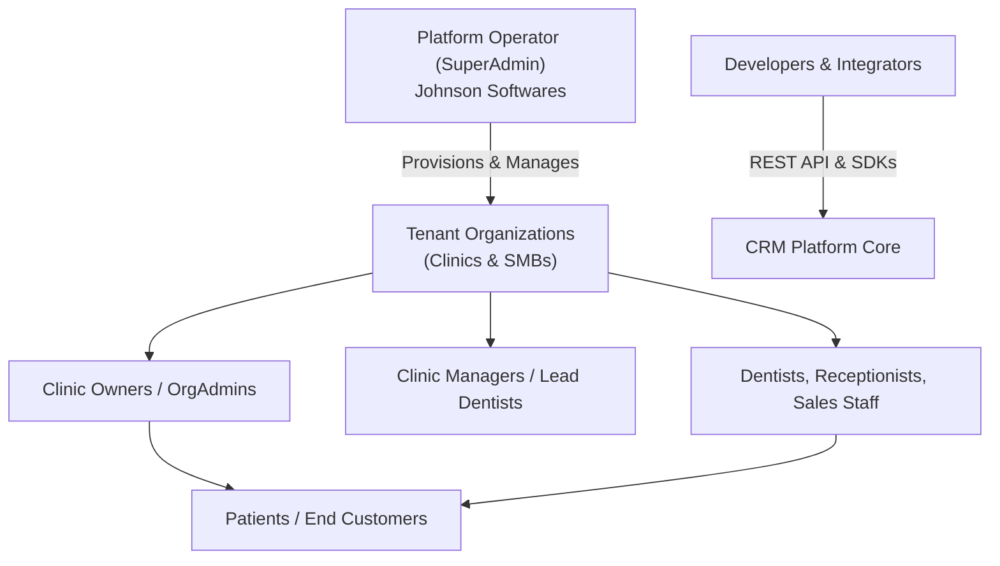

# Multi-Tenant Dental-First CRM SaaS — Development Specification & Product Guide

> **Goal:** Production-grade, multi-tenant CRM SaaS with a **dental-clinic vertical** as the flagship experience, self-serve trials, plan-based feature gating, mobile app integration, and an integrated AI layer. Serves multiple independent businesses ("tenants") from a single deployment with strict data isolation.

---

## 🧩 1. Technical Stack & Architecture

- **Backend:** Python **FastAPI** (async), **SQLAlchemy** (async) + **Alembic** migrations, **PostgreSQL**, **Redis** (caching, rate-limiting, background queues).
- **Frontend:** **React + TypeScript + Vite + Tailwind CSS**, custom theme tokens with **light/dark mode**.
- **Mobile:** **Native Android** (Kotlin + Jetpack Compose + Material 3 + Room DB + Retrofit + Hilt) with offline-first caching and automatic synchronization.
- **Authentication:** JWT access + refresh tokens, bcrypt password hashing, 6-digit numeric OTP / verification tokens, email password resets.
- **Deployment & Ops:** Docker Compose behind **Nginx Proxy Manager** (TLS/HTTPS), production frontend served via Nginx with `/api` reverse-proxy to FastAPI uvicorn workers; auto-executing `alembic upgrade head` on start.
- **Multi-Tenancy:** Every domain entity carries `organization_id`; strict org-scoped queries and RBAC; platform-level SuperAdmin control plane.
- **Third-Party Integrations:** SMTP email, **WhatsApp** (Meta Cloud API), **SMS** (BhashSMS / Twilio), **Telephony** (MyOperator / Knowlarity click-to-call), **Payments** (Cashfree), S3-compatible object storage for PDFs/attachments.

---

## 👥 2. Roles & Access Control (RBAC)

- **`SuperAdmin`**: Platform owner (manages tenants, pricing plans, feature catalogs, subscriptions, trial approvals).
- **`OrgAdmin`**: Tenant / Practice owner (full control over clinic settings, staff licenses, billing, customer data).
- **`Manager` / `Team Leader`**: Clinic manager / Lead dentist (oversight, department targets, team assignments).
- **`Employee`**: Attending dentists, receptionists, telecallers, sales reps (day-to-day operations: patients, chairs, appointments, calls, invoices).
- **Plan-Driven Feature Gating**: Server-side permission guards + client-side UI visibility gated dynamically by the organization's active plan subscription.

---

## 🏢 3. SaaS / Platform Layer (SuperAdmin Control Center)

- **Tenant Lifecycle Management**: Provision, suspend, soft-delete, and restore tenants; configure organization currency symbols and timezones.
- **Plans & Tiered Packaging**: 4 tiers (**Starter / Growth / Professional / Enterprise**) with feature flags, promotional pricing (struck-through original price + discount percentage badge), seat minimums, and setup fees.
- **Self-Serve Trials**: Public registration (`/auth/register`) with automatic provisioning (organization + admin user + 14-day Professional trial + default sales pipelines) and welcome invitation emails.
- **Subscription Billing**: Seat licensing, automated invoice generation, GST/tax calculation, coupon codes, and payment reconciliation.
- **Platform Auditing**: Tenant access logs, system health checks, and global communication templates.

---

## 💼 4. CRM Core Foundation

- **Leads & Enquiries**: Automated scoring, deduplication, priority tags, interaction timeline, bulk import/export.
- **Contacts & Companies**: Centralized directory, account hierarchy, custom tags, and communication history.
- **Customers & Order-to-Cash**: Customer accounts, orders, contracts, invoices, payments, and dunning workflows.
- **Tasks & Reminders**: Bucketized tasks (Today, Upcoming, Overdue, Completed), recurring schedules, and push/browser reminders.
- **Calendar & Appointments**: Multi-user calendars, working hours, operatory rooms, and iCal sync.

---

## 🎯 5. Sales & Lead Engine

- **Custom Pipelines & Stages**: Visual Kanban boards, stage progression rules, probability metrics.
- **Lead Capture & Ingestion**: Webhook listeners for Facebook Lead Ads, Google Ads, Instagram, and custom website forms.
- **Distribution & Routing**: Round-robin assignment, team leader overrides, and lead transfers.
- **Dynamic Metadata Engine**: Tenant-defined custom fields and dynamic attributes across leads, patients, and accounts.

---

## 🦷 6. Dental Vertical (Flagship Experience)

- **Patient Directory & EHR**: Fast patient search, attending doctor assignments, medical histories, and clinical notes.
- **Register / Walk-In Modal**: Quick patient onboarding matching high-pace clinic workflows.
- **Chair & Operatory Scheduler**: Real-time doctor availability and chair load balancing.
- **Treatment & Price Master**: Standardized procedure catalog with pre-configured unit pricing.
- **Odontogram & Dental Charting**: Interactive graphical tooth charting (adult & child arches) across mobile and web.
- **Branded Patient Invoicing**: Itemized PDF receipts with clinic letterhead, doctor details, amount-in-words, and one-click **"Send on WhatsApp"** via secure links.
- **Patient Recalls & Retention**: Automated 6-month checkup reminders, post-op care follow-ups, and recall queues.

---

## 💬 7. Multi-Channel Communications Hub

- **WhatsApp Business API**: 24-hour customer service window, pre-approved notification templates, media sharing, delivery receipts.
- **SMS Integration**: Transactional & promotional SMS routing via BhashSMS / Twilio.
- **Email Service**: SMTP / IMAP outbound communication with open/click telemetry.
- **Telephony & Dialer**: Integrated click-to-call, call recording playback, disposition tracking, and auto-logging into customer timelines.
- **Campaign Manager**: Bulk broadcasts, scheduled dispatches, and conversion tracking.

---

## 📊 8. Analytics & Executive Reporting

- **Live Dashboards**: Persona-specific cockpits (Executive, Clinic, Sales, Telecaller) with live data and zero hardcoded mock values.
- **Marketing ROI & Attribution**: Lead source conversion rates, acquisition costs, and channel efficiency.
- **Clinical & Financial Reports**: Daily billing, doctor collections, procedure breakdown, outstanding receivables.
- **KPI & OKR Engine**: Conversion targets, employee activity tracking, and automated scheduled report distribution.

---

## ⚡ 9. Workflow & Automation Engine

- **Visual Workflow Designer**: Trigger-condition-action orchestration with versioning.
- **Event Bus & Webhooks**: Async event dispatcher with automatic retries and dead-letter queues.
- **Background Task Queue**: Redis-backed async workers for PDF generation, bulk emails, and data imports.
- **SLA & Escalation Engine**: Response time monitoring, threshold alerts, and automated escalations.

---

## 🧠 10. AI Copilot & Intelligence Suite

- **LLM Gateway**: Multi-model integration with caching, token budgeting, and streaming responses.
- **CRM Copilot**: Natural language queries converted to structured actions and data lookups.
- **Lead & Communication Intelligence**: Sentiment analysis, conversation summaries, lead qualification scoring.
- **Document Intelligence**: Automated OCR and key field extraction from medical records and receipts.
- **AI Security & Governance**: Automated PII redaction and prompt injection guards.

---

## 📱 11. Native Mobile Client (`mobile/android`)

- **Modern Android Architecture**: 100% Kotlin, Jetpack Compose, Material 3, Room Local DB, Retrofit, Coroutines/Flow, Hilt DI.
- **Direct VPS Backend Sync**: Pre-configured to communicate with `https://crm.johnsonsoftwares.com/api/v1/`.
- **Offline-First Storage**: Local database caching allowing doctors and sales reps to review leads, patients, tasks, and appointments without active internet.
- **Calling Cockpit**: Instant disposition logging and follow-up scheduling right from mobile phones.
- **Biometric Security**: Fingerprint & Face Unlock support via Android `BiometricPrompt`.

---

## 👥 12. Target Audience & User Breakdown

### A. The Platform Operator (`SuperAdmin`)
- Manages SaaS infrastructure, tenant health, licensing plans, payment gateways, and platform revenue.

### B. Tenant Businesses (Paying Customers)
- **Primary Market**: Dental clinics, dental chains, multi-specialty healthcare practices.
- **Secondary Market**: SMBs, sales agencies, real-estate firms, consulting agencies needing a CRM.

### C. End Patients & Customers (External Users)
- Receive WhatsApp/SMS appointment reminders, branded digital invoices with payment links, and service updates.

### D. Developers & Ecosystem Integrators
- Build custom apps using the OpenAPI/REST endpoints, webhooks, and mobile SDKs.
